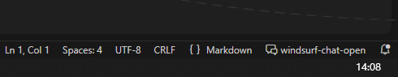

# WindsurfChatOpen

让 AI 停下来听你说话 - 随时介入对话，精准反馈指令

[](https://github.com/michaelbarrera21/windsurf-chat-open/releases)
[](LICENSE)

## ✨ 核心特性

- **🎯 随时介入** - AI 执行过程中随时暂停，等待你的反馈指令
- **📁 文件拖拽** - 支持拖拽文件/文件夹到输入框，自动转换为相对路径
- **🖼️ 图片反馈** - 粘贴/拖拽图片，支持截图、图片文件
- **🔀 双面板模式** - 支持同时与两个 AI 对话（Arena 模式）
- **📊 工具统计** - 实时显示 AI 调用的工具数量和类型
- **⏱️ 超时保护** - 可配置的超时时间，防止 AI 无限等待
- **🔔 桌面通知** - AI 等待反馈时弹出系统通知
- **🎨 主题自适应** - 完美适配 VSCode 浅色/深色主题
- **📂 多工作区支持** - 多 IDE 实例、多项目互不干扰

## 🚀 快速开始

### 1. 安装插件

从 [Releases](https://github.com/michaelbarrera21/windsurf-chat-open/releases) 下载 `.vsix` 文件：

```
Ctrl+Shift+P → Extensions: Install from VSIX...
```

### 2. 配置全局提示词

在 Windsurf **全局提示词 (Global Prompt)** 中添加：

```
遵循工作区规则，每次回复结束前调用脚本
```

### 3. 打开面板

点击底部面板标签 `ChatOpen-A` 或使用快捷键 `Ctrl+Shift+W`



## 📖 使用说明

### 文件创建

插件会在项目根目录自动创建：

| 文件/目录 | 说明 |
|-----------|------|
| `.windsurfchatopen/` | 存储核心脚本和会话数据 |
| `.windsurfrules` | 工作区规则文件，AI 自动读取并遵循 |

> 💡 如果是 Git 项目，上述文件会自动添加到 `.gitignore`

### 输入方式

- **文本输入** - 直接在输入框中输入指令
- **文件/文件夹拖拽** - 拖拽到输入框，显示为标签 `📄 文件名` 或 `📁 文件夹`
- **图片粘贴** - `Ctrl+V` 粘贴截图或图片
- **图片拖拽** - 拖拽图片文件到输入框

### 快捷操作

| 快捷键 | 功能 |
|--------|------|
| `Ctrl+Enter` | 发送消息 |
| `Escape` | 结束当前对话 |
| `Ctrl+Shift+W` | 聚焦到面板 |

### 超时配置

点击设置图标 ⚙️ 可配置超时时间：
- 预设选项：30分钟、1小时、4小时
- 设为 0 表示无限制

## 🔧 技术架构

```
┌─────────────────────────────────────────────────────────────┐
│                     Windsurf IDE                            │
│  ┌──────────────┐    HTTP     ┌─────────────────────────┐  │
│  │   AI Agent   │ ◄────────► │   WindsurfChatOpen      │  │
│  │  (Cascade)   │             │   Extension             │  │
│  └──────────────┘             └─────────────────────────┘  │
│         │                              │                    │
│         ▼                              ▼                    │
│  ┌──────────────┐             ┌─────────────────────────┐  │
│  │ windsurf_    │             │   Webview Panel         │  │
│  │ chat.cjs     │             │   (User Interface)      │  │
│  └──────────────┘             └─────────────────────────┘  │
└─────────────────────────────────────────────────────────────┘
```

## 📝 更新日志

查看 [CHANGELOG.md](CHANGELOG.md) 了解完整的版本历史。

## 📄 开源协议

[MIT License](LICENSE)

---

**Made with ❤️ for better AI collaboration**
